# user-registration-app
A basic user registration app using Spring Boot, Spring Security, Hibernate, MySQL, Thymeleaf and Bootstrap.

First of all, execute the program to drop tables if they exist and create new ones:
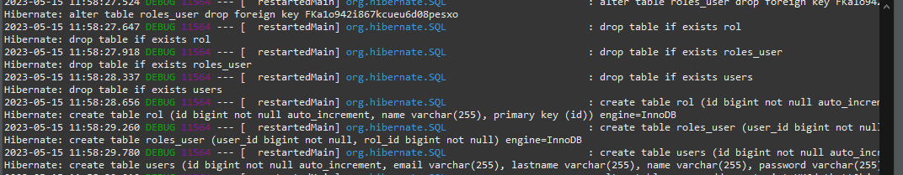

Verify in MySQL that the tables were created successfully:
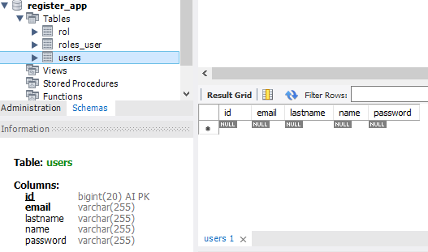

Access the login form in the endpoint /login:
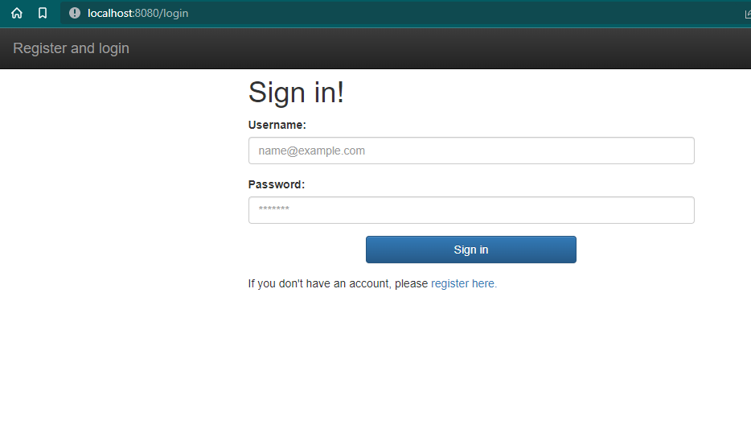

Click on 'register here' and complete the form to register a new account:
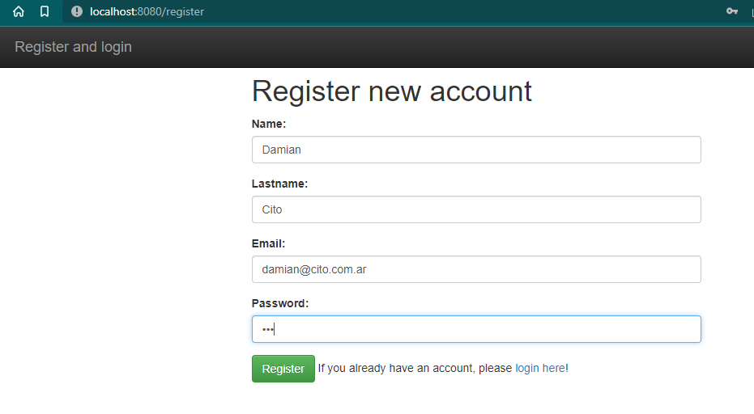

Registration successful:
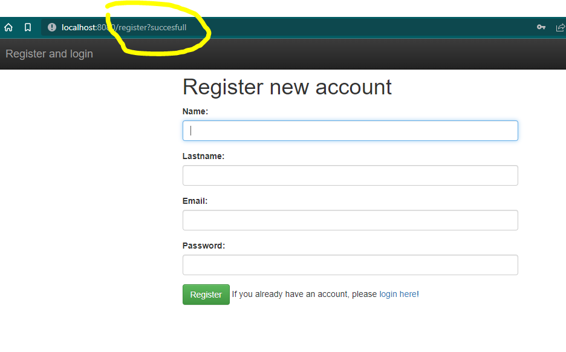

Complete the login form to sign in:
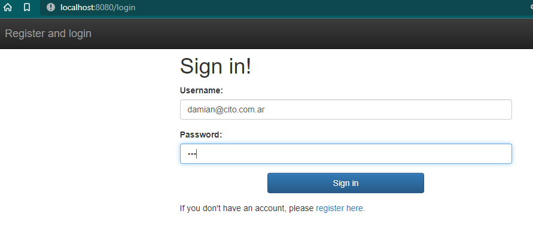

We logged in successfully and can now access data:
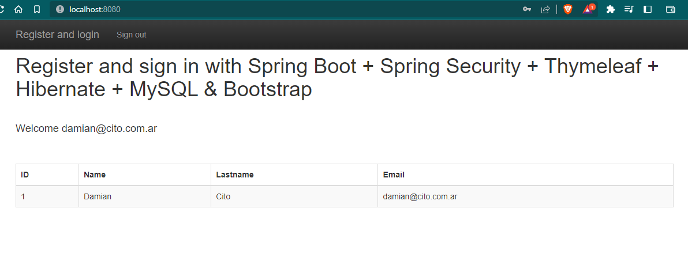

The user is registered in the database:
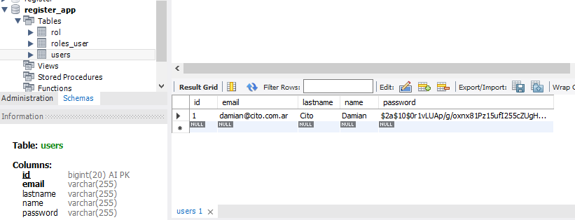

Check the sign-out button:
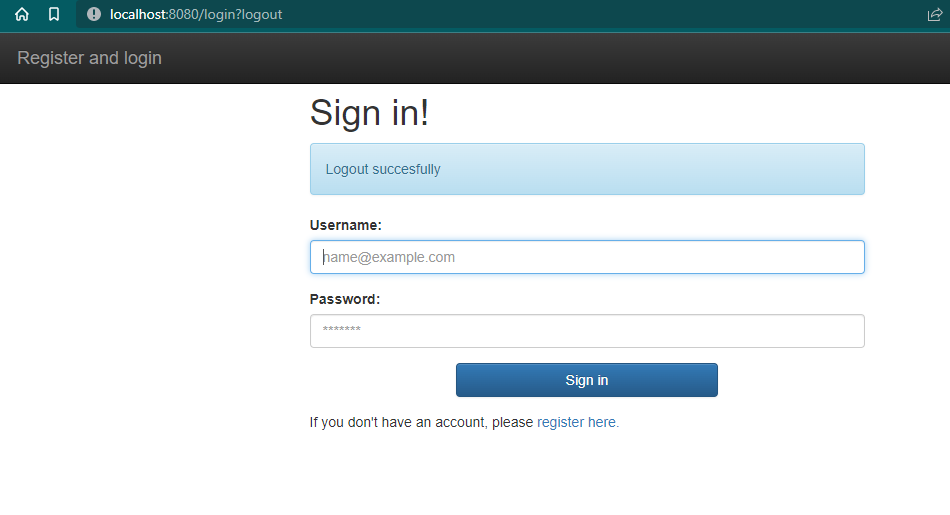

Register more users:
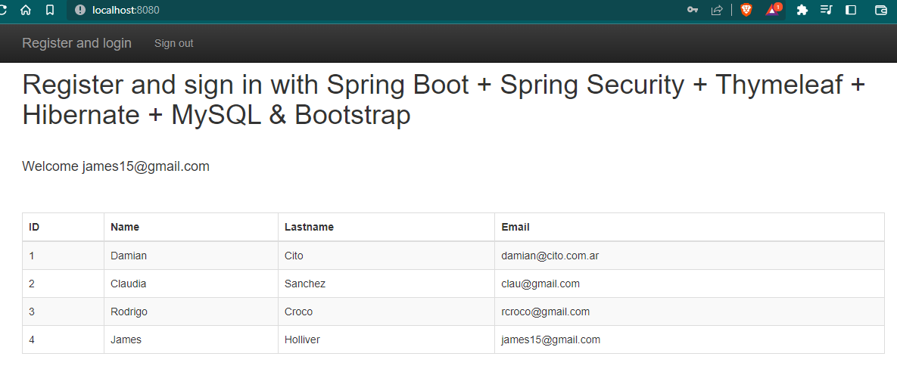

Table in MySQL with all registered users:
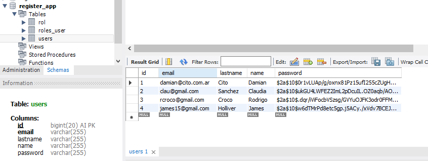
